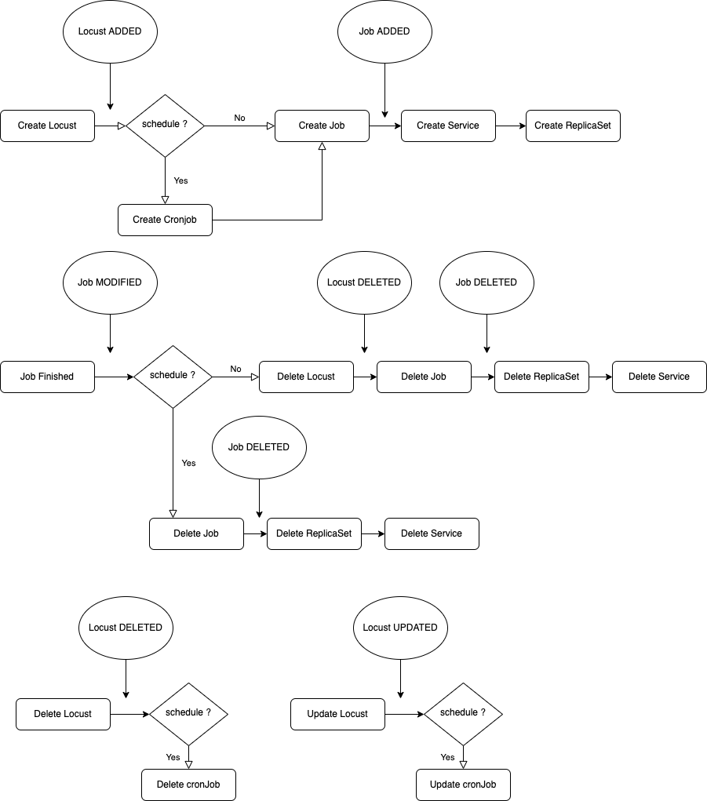

# Locust operator for k8s

An operator to run Locust on kubernetes cluster. Running Locust distributed without the web UI. Useful for CI jobs and
cronjobs.

## Usage

[Deploy operator](doc/deploy-operator.md)

[Deploy Locust example](doc/deploy-locust.md)

## Kind Locust

### Values

| Key                  | Type   | Default                | Description                                                                                                                                         |
|----------------------|--------|------------------------|-----------------------------------------------------------------------------------------------------------------------------------------------------|
| workers              | int    | `1`                    | Number of workers to deploy                                                                                                                         |
| image                | string | `locustio/locust2.8.5` | Docker Image with Locust binary                                                                                                                     |
| imagePullSecret      | string | `None`                 | Docker Image pull secret                                                                                                                            |
| command              | string | ``                     | Command to run for your Docker image                                                                                                                |
| configMapRef         | string | `None`                 | environment variables used in the load test for both master and workers, stored as configmap                                                        |
| secretRef            | string | `None`                 | environment variables used in the load test for both master and workers, stored as secrets                                                          |
| mount_external_config | dict   | `None`                 | additional mount used in the load test for both master and workers, stored in configmaps. Usage: `mountPath: yourMountLocation, name: configMapRef` |
| mount_external_secret | dict   | `None`                 | additional mount used in the load test for both master and workers, stored in secrets. Usage: `mountPath: yourMountLocation, name: secretRef`       |
| run_time             | string | `5m`                   | Stop after the specified amount of time, e.g. (300s, 20m, 3h, 1h30m, etc.).                                                                         |
| schedule             | string | `None`                 | Cron schedule expressions for run cronjob instead of job                                                                                            |

* mount_external_config and mount_external_secret name must be different

## Architecture

The controller listen events on 2 objects : Locust and Job

Locust

- event ADDED
- event MODIFIED
- event DELETED

Job

- event FINISHED
- event ADDED
- event DELETED

## Contributing

[Contributing](doc/dev.md)

## TODO

- fix when cronjob is triggered multiple times (create service + replicaset on job running (not creating and not
  pending)) -> read_namespaced_job_status
- improve update cronjob
- improve tests in CI
